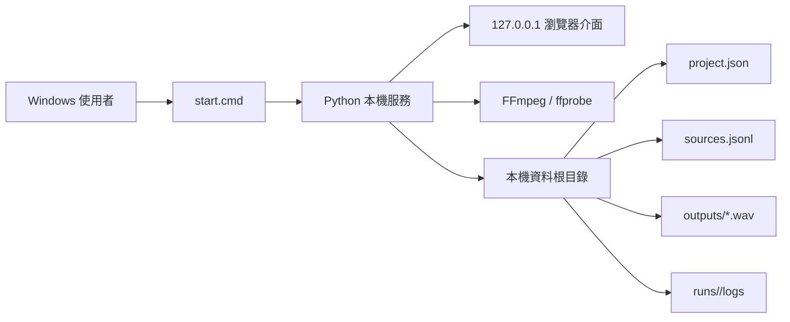
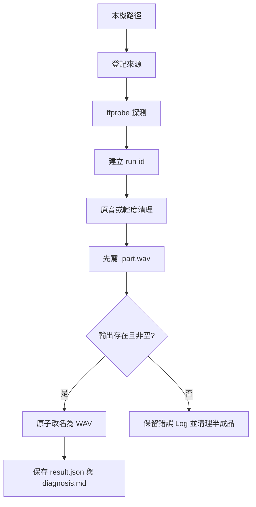

# Voice Lab 第一版部署架構

## 1. 定位

第一版不是公開網站，也不是雲端服務，而是 Windows 本機應用程式。使用者雙擊 `start.cmd` 後，Python 啟動只綁定 `127.0.0.1` 的 HTTP 服務，再由瀏覽器操作畫面。



## 2. 第一版啟動邊界

啟動時不依賴 Python 套件管理器、PyTorch 或語音模型權重以外的額外服務。必須有 Python 3.11+；FFmpeg／ffprobe 缺少時仍可打開介面，但相關動作顯示 `BLOCKED`，不偽造輸出。

第一版採 Python 標準函式庫，降低初始安裝風險。未來需要模型時，才在獨立環境接入 F5-TTS、RVC、ASR 或其他 adapter；模型環境不能讓素材整理與 WAV 基礎流程一起失效。

## 3. 資料生命週期



原始素材只讀，不因轉換而覆寫。輸出先寫暫存檔，成功後才改成 `.wav`；失敗時保留 `stdout.log`、`stderr.log` 與錯誤摘要，避免產生看似成功的空檔案。

## 4. 模型大小政策

```text
MAX_MODEL_BYTES = 4 * 1024 * 1024 * 1024
```

- 大於 4 GiB：`BLOCKED`，禁止下載。
- 等於 4 GiB：大小檢查可通過，但第一版仍不自動下載。
- 大小未知：`NEEDS_CHECK`；未來下載器必須使用串流計數，超過上限立即中止並刪除 `.part`。
- 模型檔不放在 Git；使用者自行在家中執行機準備，並記錄模型檔雜湊與授權資訊。
- 4 GiB 是檔案大小硬上限，不代表模型一定能在 GPU、RAM 或磁碟條件下執行。

## 5. 未來模型接入

模型接入必須經過：環境檢查 → 模型大小檢查 → 權重／索引配對 → 小型載入測試 → 小型輸出測試 → 品質評估。TTS 與 VC 是兩條獨立路徑；沒有模型時，第一版仍可以完成素材與 WAV 流程。

## 6. 跨電腦使用

目前開發機只負責程式、介面與測試；家中執行機另選資料根目錄。搬移時帶走程式碼、`project.json`、資料集清單與需要的 Log，不直接複製開發機的虛擬環境或絕對路徑。家中執行機第一次啟動仍須重新執行 `doctor`。

## 7. GitHub 發布範圍

可提交：Python 原始碼、UI、測試、文件、`.gitignore`、啟動檔。

不可提交：模型權重、音檔、影片、Cookie、Token、`data/`、執行 Log、虛擬環境及本機絕對路徑。推送前必須檢查：

```powershell
git status --short
git diff --stat
git ls-files | Select-String -Pattern '\.(wav|mp3|mp4|m4a|ckpt|pth|safetensors|onnx)$'
```

如果最後一個命令有輸出，先停止推送並移除檔案；不能用 `.gitignore` 掩蓋已經被追蹤的敏感檔案。
