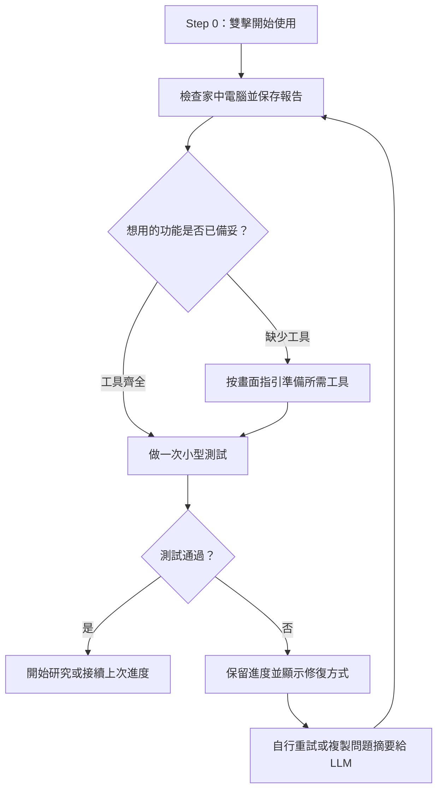
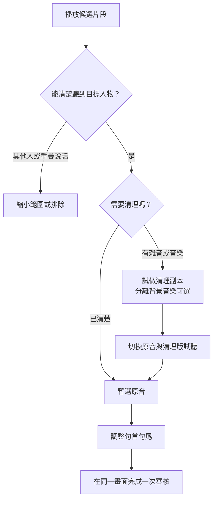
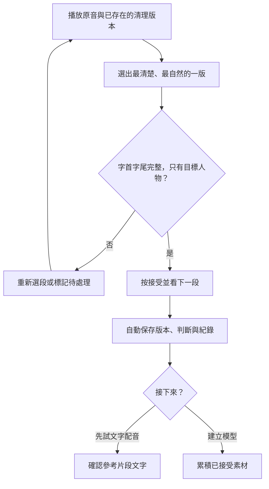
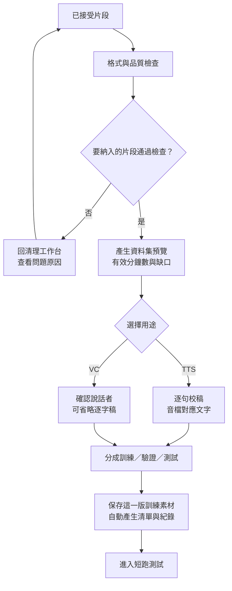
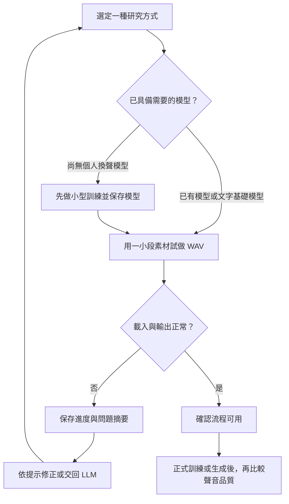

# 聲音模擬研究工具：完整實作計畫書

版本：1.2｜日期：2026-09-17｜狀態：實作前規劃，尚未安裝或驗證模型

先閱讀第 3 章的操作流程與第 9 章的畫面規格；第 4 章用來查長度限制。第 6–8 章供開發與除錯參考，不要求初學者先讀懂才能操作。文件中的按鈕及啟動檔皆為待實作規格。

## 1. 目標與完成定義

建立 Windows 本機使用的 Python 聲音研究工具。使用者可以匯入 YouTube 音訊或本機錄音，透過操作介面挑選說話片段、清理、切句、建立資料集，分別完成：

1. **文字轉語音（TTS）**：輸入文字，使用參考聲音或微調後的模型生成 WAV。
2. **聲音轉換（VC）**：輸入自己念出的錄音，使用訓練好的目標聲音模型轉換音色並輸出 WAV。

完成點是能播放、比較、儲存及重新開啟輸出的 WAV。使用情境為個人研究；不包含影片合成、發布平台、即時通話變聲或從零訓練大型基礎模型。

兩項功能共用素材管理與清理工具，但各自執行。**TTS 不需要先經過 VC，VC 也不需要先經過 TTS。** 本計畫的「訓練」指在已有基礎模型上進行目標聲音訓練／微調；只用參考音訊生成則稱為「參考音訊推論」，不算已完成訓練。

本次交付計畫書及工作紀錄。下文的介面、模組、設定名稱、目錄、驗收指令均為擬定設計；除「開發機環境快照」外，不代表已經建置或執行。正式能否執行，要以家中那台電腦第一步產生的環境檢查 Log 判定。

## 2. 電腦角色與環境判斷

### 2.1 開發機與執行機分工

本計畫分成兩台電腦：

| 電腦 | 用途 | 必須完成的事情 |
| --- | --- | --- |
| 目前這台開發機 | 建立 Python 專案、介面、資料格式、測試用假音檔、文件及基本 FFmpeg 流程 | 能開啟程式、執行測試、產生測試 Log；不以它完成模型訓練作為計畫前提 |
| 家中執行機 | 實際下載／匯入素材、清理、訓練、TTS／VC 生成 WAV | 第一次啟動先執行環境檢查，依實際結果選擇可行路線 |
| 可選外部 GPU 機 | 家中執行機不足時，執行訓練任務 | 只搬移版本化資料集、設定及必要模型；完成後把訓練 Log 與 WAV 帶回 |

因此，計畫書開頭的第一個實作步驟不是判斷目前這台電腦能不能訓練，而是開發機完成一個可重複執行的 `doctor` 環境檢查工具。到了家中執行機，再用同一個工具產生真正的硬體判定。

### 2.2 開發機環境快照（僅供開發參考）

2026-09-17 透過唯讀指令取得目前開發機狀態：

| 項目 | 實測結果 | 對計畫的影響 |
| --- | --- | --- |
| 顯示卡 | NVIDIA GeForce RTX 3050 Laptop GPU | 僅作為開發機參考，不作家中執行機限制 |
| 顯示記憶體 | 4,096 MiB，約 4 GiB | 可用來設計低資源測試，不代表訓練可行 |
| 驅動程式 | 591.74 | 僅保存快照，家中執行機要重新檢查 |
| 主記憶體 | 16 GiB | 可用來開發介面與跑測試 |
| Python | PATH 中的版本為 3.14.3 | 不直接用來安裝整套語音工具；建立獨立相容環境 |
| FFmpeg | 8.0，已能執行 | 可用於開發期格式測試；家中執行機要重新檢查 |
| C 槽剩餘容量 | 約 12 GiB，會隨時間變動 | 開發機空間參考，不作執行機容量結論 |

取得結果的指令為 `nvidia-smi --query-gpu=name,memory.total,driver_version --format=csv,noheader`、`python --version`、`ffmpeg -version`、`Get-CimInstance Win32_ComputerSystem` 及 `Get-PSDrive C`。未掃描個人檔案，也沒有清除磁碟內容。

### 2.3 家中執行機的路線判定

家中執行機第一次啟動要依序檢查：作業系統、CPU 核心數、RAM、GPU 型號、VRAM、驅動程式、CUDA／PyTorch、Python、FFmpeg／ffprobe、JavaScript runtime、磁碟空間及模型目錄權限。檢查工具輸出 `PASS / WARNING / BLOCKED`，由規則決定下面的路線：

- **完整本機候選路線**：基本工具與資源檢查通過；各模型先標示「待小型測試」，實際載入、生成與訓練試跑分別通過後，才啟用對應功能。硬體型號相符不等於模型已測通。
- **低資源路線**：可執行清理、ASR、參考音訊推論或小型 VC 測試，但訓練項目顯示硬體風險並限制資料批次。
- **資料整理路線**：只能完成素材匯入、清理、逐字稿及資料集版本；資料集可匯出給另一台訓練機。
- **功能待準備**：依功能顯示缺少項目。例如沒有聲音模型仍可整理素材；沒有 YouTube 下載工具仍可匯入本機檔案。僅阻擋依賴缺失項目的動作，整體啟動器與紀錄匯出仍可使用。

路線判定永遠引用當次 `environment.json`，不引用這台開發機的快照。當家中執行機更換 GPU、Python 或資料目錄時，必須重新執行檢查；舊的成功 Log 不能直接套用。

### 2.4 硬體與容量預算

以下是本專案的工程規劃值，並非模型官方最低需求或採購保證。實際數值由家中執行機的環境檢查與 P0 短跑重新確認：

| 工作 | 建議規劃 | 開始前的決策方式 |
| --- | --- | --- |
| 素材整理與短句推論 | RAM 16 GiB、可用 SSD 30 GiB 起 | 先量測單一模型及 1 分鐘素材 |
| RVC 小型訓練 | GPU 6–8 GiB 較有餘裕；低於此值先做小型試跑 | 100 次更新＋模型儲存＋轉換全部通過才放大 |
| F5-TTS 微調 | GPU 16–24 GiB、RAM 32 GiB 作為初始估算 | 短片段、小批次測峰值；仍可能須調整 |
| 完整雙模型工作目錄 | SSD 可用 60–100 GiB 作為初始容量預算 | 根據實際套件、模型、檢查點大小重新估算 |

安裝空間、下載暫存、模型權重、資料衍生檔及訓練檢查點要分開計算。可以指定另一個非同步磁碟目錄作為資料根目錄，但必須先確認實際路徑與空間；目前沒有選定或修改任何路徑。

目前專案位於 OneDrive 路徑。若該資料夾有啟用同步，放入其中的錄音與模型可能會被同步；「模型在本機執行」不等於「資料絕不離開電腦」。實作時提供明確的資料根目錄選擇，大型模型及錄音優先存放在使用者指定的非同步目錄。開發機與家中執行機都要各自記錄資料根目錄，不能把開發機的絕對路徑寫死在資料集。

## 3. 使用者實際操作流程

### 3.0 開始前先做環境檢查

家中執行機先雙擊「開始使用.cmd」。這個輕量入口由 Windows 內建指令／PowerShell 進行基礎檢查，不依賴尚未安裝的 Python、PyTorch 或語音模型。檢查失敗時保留視窗與報告位置；若無法開啟程式介面，仍能取得文字 Log。執行原則造成阻擋時顯示具體原因，不要求永久放寬系統設定。

基本環境備妥後，進入「檢查環境」畫面，補做模型與實際運算測試。正常結果可直接繼續；只有看不懂或處理不了的錯誤才需要「複製問題摘要」交回 LLM。每個功能分別顯示「可使用／待安裝／待測試／暫不可用」，不要求所有模型一次裝齊。

選擇研究方式後，只準備該功能需要的工具，顯示下載項目、預估大小、目的地與可用容量。能取得檔案總量才顯示下載百分比；中斷後保留已驗證下載，是否能續傳依來源能力判定。成功後重新檢查相關功能。



使用者要做的事只有三個：選擇資料根目錄、按「檢查環境」、保存診斷摘要。系統要產生：檢查項目、目前值、通過／警告／阻擋、修復建議、完整 Log 路徑及可下載的診斷包。診斷包不得包含 cookie、token、密碼或原始音訊，除非使用者另外選擇附加音訊。

環境檢查至少記錄以下內容：

| 類別 | Log 內容 | 失敗時給使用者的訊息 |
| --- | --- | --- |
| 基本環境 | Windows 版本、CPU 核心數、RAM、可用磁碟 | 顯示實際容量與需要的最低工作空間 |
| GPU | 型號、VRAM、驅動程式、CUDA 是否可用 | 顯示可用路線與不能執行的模型任務 |
| Python | 執行檔絕對路徑、版本、虛擬環境 | 指定要使用的環境，不直接改系統 Python |
| 媒體工具 | `ffmpeg`、`ffprobe` 版本與路徑 | 顯示安裝位置或 PATH 問題 |
| YouTube 取得 | `yt-dlp`、`yt-dlp-ejs`、JavaScript runtime | 只阻擋 YouTube 匯入，不阻擋本機音檔工作 |
| 語音模型 | F5-TTS／RVC adapter、權重、索引是否存在 | 顯示需要下載或模型版本不相容 |
| 寫入能力 | 資料根目錄可建立檔案、暫存及輸出 | 要求改選可寫入資料夾 |

以下命令是實作後的進階除錯入口，目前不可執行；一般使用者用啟動檔操作即可。`D:\VoiceLabData` 僅為示例，需換成實際選定路徑：

```powershell
python -m voice_lab doctor --data-root "D:\VoiceLabData" --report "D:\VoiceLabData\doctor"
```

實作後的 Log 檔案規格如下：

```text
reports/startup/<run-id>/   # 尚未建立專案前的啟動／環境報告
  environment.json       # 原始檢查結果與路線判定
  doctor.log             # 可讀的逐項檢查內容
  commands.jsonl         # 執行過的安全命令、參數及退出碼
  stdout.log             # 標準輸出
  stderr.log             # 錯誤輸出
  diagnosis.md           # 可直接貼給 LLM 的摘要
```

每個耗時工作建立 `run-id`，包括匯入、抽取、清理、ASR、分段、資料集匯出、訓練、TTS、VC 及 WAV 輸出。專案成立後紀錄統一存入 `runs/<run-id>/logs/`，並引用啟動報告 ID。播放、選段、接受、撤銷與校稿等互動寫入專案 `activity.jsonl`，不為每次點擊建立一個模型任務。介面提供「複製診斷摘要」及「匯出診斷包」；Log 中記錄資料集版本、模型版本、輸入檔雜湊、設定值、耗時、記憶體峰值、退出碼及下一步建議。每次執行不把敏感資訊寫入 Log，錯誤訊息仍保留完整階段與原因。

### 3.0.1 全流程總圖

以下以直式主線配合左右分支，避免整張橫圖縮小到看不清。使用者先選「文字配音」或「錄音換聲」，再準備對應素材；兩項研究可以在同一專案中分別完成。

```mermaid
flowchart TD
    A["Step 0：檢查家中電腦"] --> B["Step 1：建立專案並選研究方式"]
    B --> C["Step 2：匯入或錄製素材"]
    C --> D["Step 3：選出要用的語音"]
    D --> E["Step 4：必要時清理並試聽<br/>按一次接受，保存選定版本"]
    E --> F{"這次要做什麼？"}
    F -->|"文字配音：先試聽"| G["確認一段參考聲音與對應文字"]
    G --> H["輸入新台詞，產生第一份 WAV"]
    F -->|"錄音換聲：已有模型"| I["選目標聲音模型並錄一段台詞"]
    I --> J["執行換聲，產生 WAV"]
    F -->|"建立或改善模型"| K["整理多段素材<br/>文字模型另需校稿"]
    K --> L["保存資料集，做小型訓練測試"]
    L --> M["正式訓練，再用新台詞驗證"]
    M --> N["Step 5：比較、評分、另存 WAV"]
    H --> N
    J --> N
```



「文字配音：先試聽」只需要一段合格參考音訊，不要求累積訓練分鐘數或分割資料集。「錄音換聲」第一次沒有目標模型時，先進入「建立聲音模型」；已有模型則可跳過訓練。完成 WAV 後可另開另一條路線，既有素材與結果保留。

### 3.1 建立研究專案

輸入研究名稱、主要語言、聲音代號及資料儲存位置。第一版先以中文一般說話測試，介面為臺灣正體中文。保留語言欄位，不把中文寫死在資料結構；臺語、唱歌及特殊口音的品質另行評估。

開始頁顯示可用空間、模型安裝狀態及每個功能是否可執行。缺少模型仍可整理素材。聲音來源保留備註欄，以自己的錄音或可供此用途使用的素材建立可重現測試集。

### 3.2 匯入與抽取

1. 貼上單一 YouTube 網址，或拖入本機音訊／影片。
2. 先顯示標題、原始長度、聲道、取樣率，以及可取得的檔案大小估計。
3. 輸入起訖時間，例如 `00:02:10–00:12:10`；長片先選片段。
4. 預設取得音訊串流，以 FFmpeg 產生工作用音檔；保留取得的原始資料。
5. 顯示抽取結果，讓使用者先試聽，再進入清理。

`yt-dlp` 支援音訊取得與 FFmpeg 後處理；完整 YouTube 支援還涉及其 JavaScript 執行環境。實作需檢查 `ffmpeg`、`ffprobe`、`yt-dlp-ejs` 與受支援的 JavaScript runtime，不能只安裝同名 Python 套件便假設可用。[S1](https://github.com/yt-dlp/yt-dlp#dependencies)

指定片段下載不保證每種串流都只傳輸該片段；介面需區分預估與實際下載量。下載失敗提供原始錯誤摘要、重試與本機檔案匯入，不自動讀取瀏覽器登入資料。不將網址可下載視為素材用途已確認。

### 3.3 清理工作台：準備比較片段

這裡是抽取後最重要的人工步驟。工具先找出候選，不直接替使用者決定哪些聲音能拿來訓練。使用者按以下順序處理：

1. **先看原始候選**：在波形上播放片段，確認目標人物真的從頭到尾在說話。
2. **標記人物與問題**：選擇目標人物、其他人物、重疊說話、音樂、笑聲、回音或削波。
3. **決定處理版本**：保留原音；必要時建立輕度降噪版，背景音樂明顯才試做人聲分離版。
4. **比較同一時間範圍**：原音、輕度清理、分離版以同一段落試聽，避免因為裁切位置不同而誤判。
5. **調整時間邊界**：保留完整字首、字尾及自然停頓；移除前後無關的主持人或音樂。
6. **先暫選版本**：試聽後暫選原音或清理版，下一節在同一畫面一次完成接受／排除；此處不再要求第二次確認。
7. **保存版本**：原始音訊不可覆寫；每個處理版本記錄處理設定、輸入雜湊及輸出雜湊。



清理工作台的畫面要讓使用者一直看得到四件事：目前片段的原始時間、片段長度、目標人物標記、處理版本。按「接受」以前，不能只看處理後音訊；按「排除」以前，仍可回聽原始音訊。

### 3.4 清理後的比較與人工審核

比較審核是同一工作台中的最後確認區，不另跳到重複審核頁。只列出已產生的版本；沒有必要清理時，原音可直接接受。依同一片段顯示：

| 比較項目 | 使用者要聽／看的內容 | 結果 |
| --- | --- | --- |
| 原始音 A | 有沒有原本就已經夠乾淨 | 作為基準，不因波形好看而刪除 |
| 輕度清理 B | 背景是否變少、字音是否仍自然 | 標記「較佳／相同／較差」 |
| 分離版 C | 音樂是否降低、是否產生金屬聲或殘影 | 只有改善才保留 |
| 左右聲道 | 是否某一側較乾淨或包含不同人物 | 選擇聲道或保留雙聲道實驗版 |
| 片段邊界 | 開頭與結尾是否截斷 | 回到波形重新調整 |
| 語音內容 | 是否只剩目標人物，沒有重疊語音 | 接受、排除或待複核 |



比較結果保存為片段級資料，而不是只保存一個總分。第一版的接受規則是：人聲清楚、單一目標人物、沒有明顯截字、沒有新增金屬聲或抽吸聲；有疑問就標成「待複核」，不自動放入訓練資料。波形只用來找位置，音質判斷以試聽為準。

### 3.5 從審核片段建立資料集版本

本節適用於「建立聲音模型／改善文字配音模型」。只做參考音訊試聽時可跳過本節。只有人工接受的片段（內部記為 `reviewed_segments`）可以進入訓練資料集。流程如下：

1. 執行格式、長度、靜音、削波、重複片段及雜訊檢查。
2. 顯示實際有效語音總量，分開計算目標人物、其他人物、待複核及排除量。
3. TTS 逐句產生逐字稿草稿，人工修正並標記「校稿完成」；VC 可略過逐字稿，但仍要保留說話者標記。
4. 依來源場次及連續時間分成訓練／驗證／測試，避免同一句或緊鄰片段洩漏到不同集合。
5. 產生不可變的資料集版本，例如 `dataset-20260917-001`，保存清單、設定、統計及所有檔案雜湊。
6. 顯示所選訓練用途還缺多少素材；有問題的片段可排除後再算，不因少數待處理片段阻擋整個專案。資料不足仍可保存草稿，只有達該用途門檻才啟用訓練。參考試聽使用自己的短片段條件。



### 3.6 小型測試：先確認能執行，再評估品質

畫面使用「先做小型測試」，技術文件中的「短跑」指同一件事。依所選功能安排正確先後順序：

- **第一次文字試聽**：一段已接受的參考音訊、對應文字及一句新台詞，即可使用基礎模型生成。想比較時再擴充到 3 段參考音與 3 句台詞；不將此數量設成首次操作門檻。
- **第一次錄音換聲，還沒有模型**：先完成資料集，做小型訓練並保存目標模型與匹配索引，再用一段未參與訓練的錄音試轉換。基礎權重不能被列為已建立的個人聲音模型。
- **已有目標聲音模型**：選擇「匯入聲音模型包」，由工具確認權重、設定及索引配對，再匯入或錄製台詞；不重走資料整理與訓練。
- **文字模型微調**：保留基礎模型試聽結果，完成有逐字稿的資料集後，才做小型微調及重新載入。

小型訓練只檢查能否更新、儲存、重載與輸出；此時聲音不夠像，標示「流程通過，品質待正式訓練評估」，不能因尚未練好就永遠不准正式訓練。若音訊全靜音、模型無法載入或資料格式錯誤，則先修復該問題。



由畫面自動保存測試 WAV、版本、耗時及可量測的記憶體紀錄。沒有讀到記憶體資料時標示「未量測」，不能記為 0。

### 3.7 分別產生 WAV

- TTS 測試頁：選擇基礎模型或微調模型、參考片段及其文字，輸入新台詞，生成 WAV。
- VC 測試頁：選擇已訓練模型及對應索引，錄製或匯入待轉換音訊，生成 WAV。
- 結果頁：原音／參考音／輸出音並列播放、下載、重做；保存參數、片段比較結果及品質評分。

完成的 WAV 與旁附 JSON 都保留在本機，即使重新啟動工具也能再次播放及匯出。每個輸出頁都提供「查看這次執行 Log」及「複製診斷摘要」按鈕。

### 3.8 初學者先記這些名詞

| 名詞 | 在這個工具裡代表什麼 |
| --- | --- |
| 原始素材 | 從 YouTube 或本機匯入、尚未清理的音訊 |
| 候選片段 | 工具依時間或 VAD 找出的可能有人說話的範圍 |
| 清理版本 | 同一段原音經過降噪或人聲分離後的另一份檔案 |
| 人工審核 | 使用者實際試聽，決定保留、排除或待複核 |
| 資料集版本 | 一批固定不再變動、可以拿來訓練的音檔及文字清單 |
| TTS | 文字轉成語音，輸入文字，輸出 WAV |
| VC | 保留你念話的節奏與內容，把音色轉成目標聲音，輸出 WAV |
| ASR | 把錄音辨識成逐字稿草稿 |
| VAD | 找出哪一段有語音，不負責判斷是哪一個人 |
| 訓練／微調 | 用資料更新模型，使模型更符合指定聲音 |
| 推論 | 使用已存在的模型產生 WAV，不等於訓練 |
| Log | 工具做過什麼、用了什麼版本、在哪一步失敗的紀錄 |
| 診斷摘要 | 把 Log 整理成可以直接交回 LLM 的短報告 |

## 4. 影片與音訊最短、最長限制

### 4.1 先區分五種「長度」

1. 原始影片長度：例如訪談 60 分鐘。
2. 選取區段長度：例如只下載／處理其中 15 分鐘。
3. 有效目標語音總量：排除主持人、音樂、沉默及不可用片段後，可能只剩 6 分鐘。
4. 訓練切片長度：把上述資料整理成每段數秒的樣本。
5. 參考音訊或待轉換錄音長度：實際產生 WAV 時使用，與整份訓練資料量不同。

**沒有一個適用所有模型的「訓練影片至少幾分鐘、最多幾分鐘」標準。** 模型實際接收的是音訊樣本。多支短片可以累積；長片可以分段；影片時間充足也不代表有效語音足夠。

### 4.2 第一版操作限制表

除特別標明官方依據外，以下皆為「本專案第一版預設」，用來控制記憶體、等待時間與操作複雜度。應集中放在設定檔，不散落在介面程式中。

| 對象 | 最短／不足時處理 | 建議範圍 | 最長／超限時處理 |
| --- | --- | --- | --- |
| 原始影片或音檔 | 可解碼且至少 1 秒；不足拒絕匯入 | 初次挑 5–30 分鐘、單人清楚說話 | 整支匯入上限 120 分鐘；較長影片只讀資料，要求先指定區段 |
| 一次選取的處理區段 | 至少 2 秒 | 5–15 分鐘 | 每次最多 30 分鐘，可建立多個區段任務 |
| 單一本機輸入檔／單次下載 | 須包含可解碼音軌 | 優先音訊檔 | 2 GiB；本機超限先在外部裁切，下載以串流累計位元組中止，不只依賴估計值 |
| 人工審核的共用語音切片 | 2 秒；不足時回到原時間軸重新劃分 | 3–10 秒 | 15 秒；超過依停頓再切，禁止直接截斷語句 |
| F5-TTS 參考音訊 | 本專案要求至少 3 秒可辨識語音 | 5–10 秒語音，末尾約 1 秒安靜 | 包含末尾靜音總長必須 <12 秒，超過要求重選 |
| F5-TTS 訓練切片 | 本專案採 2 秒 | 3–10 秒 | 本專案採 15 秒；目前官方資料載入器範圍是 0.3–30 秒 |
| RVC 訓練前審核切片 | 本專案採 2 秒 | 3–10 秒 | 本專案採 15 秒；送入 RVC 後仍由其前處理器再次切分 |
| VC 待轉換錄音 | 至少 1 秒且包含語音 | 首輪 5–30 秒 | 第一版 5 分鐘；長錄音分段處理後組回 WAV |
| TTS 單次文字提交 | 至少一個可發音字元，不能只有空白／標點 | 首輪 10–50 字 | 第一版 500 字元，預先分句；產物超過 5 分鐘則保留部分結果並回報超限 |
| 單次資料集版本 | 見下一表 | 先做小而乾淨的資料集 | 第一版已確認語音總量最多 120 分鐘；更多資料分版本比較 |

影片整支匯入與區段任務是兩種模式：60 分鐘整片可以匯入後在後端分批分析；3 小時影片則須先選取不超過 30 分鐘的區段。任一模式都同時受檔案大小及磁碟預算限制。未知時長的直播與未結束首播，第一版不支援。

F5-TTS 官方目前建議參考音訊短於 12 秒，單次模型生成的參考音加輸出音共用約 30 秒限制，CLI／UI 可將長文字分段。因此，30 秒不是整個輸出 WAV 的絕對上限，也不是影片上限。[S2](https://github.com/SWivid/F5-TTS/blob/main/src/f5_tts/infer/README.md)

F5-TTS 的 0.3–30 秒是目前資料載入器的過濾條件，不代表 0.3 秒適合作為高品質樣本。匯出前必須主動檢查，不能將完全不合格的資料交給載入器反覆尋找下一筆。[S3](https://github.com/SWivid/F5-TTS/blob/main/src/f5_tts/model/dataset.py)

RVC 目前前處理程式有再次切片與重疊處理；其 `per` 可由呼叫端傳入，不能把程式內的預設數值當成所有版本的固定限制。第一版由後端適配器記錄實際使用值。[S4](https://github.com/RVC-Project/Retrieval-based-Voice-Conversion-WebUI/blob/main/train/preprocess.py)

### 4.3 各用途需準備多少有效語音

本表的有效語音為「已人工接受、去重的單一目標聲音片段總時長」，包含稍後保留的驗證／測試部分；介面還須另外顯示實際進入訓練的分鐘數。不是影片總時長，也不把重複複製的片段重複算入。

| 用途 | 本專案開始條件 | 建議準備量 | 說明 |
| --- | --- | --- | --- |
| TTS 參考音訊推論 | 一段符合上一表的參考音訊及正確文字 | 先挑 3–5 段候選，各 5–10 秒語音，逐段測試 | 不需要建立數十分鐘資料集，不產生專屬訓練模型 |
| RVC 小型訓練實驗 | 5 分鐘可進入實驗模式；5–10 分鐘顯示資料不足建議 | 10–30 分鐘乾淨語音 | 5 分鐘是本專案試驗門檻；官方建議至少 10 分鐘低雜訊語音 |
| F5-TTS 小型微調實驗 | 至少 10 分鐘且逐字稿全部審核 | 30–120 分鐘，先以 30–60 分鐘開始 | 是工程建議，官方沒有承諾一個通用最低分鐘數；少量資料可能過度擬合 |
| 固定驗收素材 | 另外準備未用於訓練的台詞／錄音 | 20 句 TTS 台詞、10 段 VC 錄音 | 不可拿訓練句重播成功代替泛化測試 |

RVC 官方 README 的「少量資料」與至少 10 分鐘的建議是可參考的起點，不是「最多只能訓練 10 分鐘」。[S5](https://github.com/RVC-Project/Retrieval-based-Voice-Conversion-WebUI/blob/main/docs/en/README.en.md)

估算需要多少原始影片，可使用：

`需要的原始分鐘數 = 目標有效分鐘數 ÷ 目標人物發言占比 ÷ 品質保留率`

例如希望保留 20 分鐘，目標人物說話占 50%，其中 80% 可用，原始素材估計需要 `20 ÷ 0.5 ÷ 0.8 = 50` 分鐘。這是示例估算；工具應先分析 5 分鐘樣本，再用實測保留率更新。

## 5. 抽取、清理與標記工具規格

### 5.1 內建清理工作台：第一版必要功能

| 工具 | 使用者操作 | 系統行為與完成標準 |
| --- | --- | --- |
| 波形與播放 | 縮放、拖曳區段、循環播放、調整播放速度 | 邊界可精確輸入秒數；速度只影響試聽，不改訓練資料 |
| 手動切割／合併 | 游標切開、相鄰區段合併、恢復上一步 | 合併只能基於連續原始時間範圍；不能把不同句子硬接成新句 |
| 說話偵測 | 點選「找出有說話的地方」 | 使用 VAD 產生候選，不直接判定說話者身分 |
| 說話者標記 | 聽候選片段並選擇人物 A／B／排除 | 預設人工標記可完成全流程，不依賴自動分群服務 |
| 可選背景音樂分離 | 試處理 10–30 秒，聽前後差異 | 產生新版本；失真明顯可退回原版，不強制套用 |
| 輕度降噪 | 選擇關閉／輕度，再試聽 | 第一版採保守 FFmpeg 濾鏡設定；不連續堆疊多輪清理 |
| 音量檢查 | 查看太小聲、削波等警示 | 先標記，必要時調整增益；不把調小音量說成已修復破音 |
| 自動切句 | 按停頓產生 2–15 秒候選 | 保留字首字尾；邊界附近重疊說話的片段預設排除 |
| 逐字稿編輯 | 逐句播放並修改文字 | 保存原辨識結果與人工修訂；TTS 匯出要求審核完成 |
| 批次保留／排除 | 依長度、人物、問題標籤篩選 | 每個被排除片段有原因；不刪除原始檔 |
| 品質統計 | 查看可用分鐘數及缺口 | 分別顯示「還差多少 VC 資料」「還差多少 TTS 校稿」 |

波形可用 wavesurfer.js 的 Regions、Timeline 等元件實作；波形元件負責互動，實際裁切由後端依時間碼執行。[S6](https://wavesurfer.xyz/)

### 5.2 自動化工具各自能做什麼

- **FFmpeg／ffprobe**：探測格式、抽取、裁切、重新取樣、聲道處理及 WAV 輸出。保留來源聲道，先檢查左右聲道是否分別錄到不同人物，再決定選單邊或混音。[S7](https://ffmpeg.org/ffmpeg.html)
- **Silero VAD**：找出有語音的時段。分析使用 16 kHz 副本；時間碼回映到原始音訊，避免讓低取樣率分析檔成為所有訓練素材的母檔。[S8](https://github.com/snakers4/silero-vad)
- **faster-whisper**：產生逐字稿草稿與時間資訊。中文人名、數字、口頭語及中英夾雜須人工校正；自動時間資訊不視為逐字強制對齊保證。[S9](https://github.com/SYSTRAN/faster-whisper)
- **audio-separator**：提供人聲／伴奏等來源分離的可選後端。分離模型另行下載並核對各自授權；聲音已乾淨時略過。[S10](https://github.com/nomadkaraoke/python-audio-separator)
- **pyannote.audio Community-1**：第二階段可選的說話者分群，用來標出何時是 A、何時是 B。它不等於把同時說話的兩人音訊乾淨拆開；重疊語音優先排除。模型下載涉及 Hugging Face 帳號與使用條件，未啟用時仍可人工完成。[S11](https://huggingface.co/pyannote/speaker-diarization-community-1)

### 5.3 外部工具輔助

提供「匯出待修片段」「匯入修訂版本」；疑難片段可用 Audacity 人工修剪與檢查，再放回工作台。修訂音檔要重新探測時長、標記新版本及重新校對文字，不能直接繼承舊時間碼。[Audacity 官方網站](https://www.audacityteam.org/)

第一版以內建波形選段、基本清理、逐字稿校正完成正常流程。外部工具作為複雜修音補充；不要求使用者每一句都切換應用程式。

### 5.4 清理判定與限制

採「原始音訊 → 可選分離／降噪 → VAD 候選 → 人工選人與切句 → 校稿 → 版本化匯出」。不同聲道先選擇再混音；已很乾淨的素材直接切句。

以下為待首輪樣本校準的專案初始警示值，不是音訊品質的通用標準：

| 檢查 | 初始處理 |
| --- | --- |
| 無法解碼、零長度、非有限數值 | 阻擋該片段匯出，指出來源及時間碼 |
| 全靜音或 VAD 無語音 | 排除；允許人工修正誤判，但全零訊號不能當有效語音 |
| 絕對振幅 ≥0.999 的樣本占比 >0.1% | 標示疑似削波，人工試聽；此檢測不能涵蓋所有壓縮失真 |
| 語音比例 <60% | 提示沉默偏多，重新選段；不自動刪除自然停頓 |
| 長度不在資料集允許範圍 | 重新分段，不靠補零或複製音訊湊長度 |
| 明顯音樂、人聲重疊、嚴重回音、機械聲 | 人工排除或另存實驗組，不混入第一批乾淨訓練資料 |
| 逐字稿缺漏／與聲音不符 | 阻擋 TTS 匯出；VC 可獨立完成 |

不承諾從混雜節目音訊完美還原乾淨人聲；清理過度本身會破壞音色。保留處理前後版本才能判斷模型表現差是素材或訓練造成。

## 6. 模型選型與兩條實作路線

### 6.1 選型結論

| 功能 | 第一選擇 | 選擇理由 | 必須先驗證的項目 |
| --- | --- | --- | --- |
| TTS 參考推論與微調 | F5-TTS v1 Base | 同一專案提供參考音訊推論、訓練及微調途徑 | 中文台詞、家中執行機短句測試、字典及微調匯入格式 |
| VC 目標聲音訓練與轉換 | RVC | 主流程符合「建立目標音色模型，再轉換自己錄音」 | 固定版本的 Windows 安裝、小批次訓練、權重與索引配對 |
| 可選快速比較 | OpenVoice V2 | 可作參考聲音推論的比較基準 | 另立環境與效果測試，不作 RVC 訓練成功的替代證據 |

F5-TTS 官方提供推論 API／CLI 與微調工具；程式碼為 MIT，但官方預訓練模型標示 CC-BY-NC，兩者不可混同。[S12](https://github.com/SWivid/F5-TTS)

OpenVoice 官方說明 V1／V2 採 MIT，支援音色複製及多語言；本專案先集中完成 F5-TTS 與 RVC，避免第一版同時維護三套語音後端。[S13](https://github.com/myshell-ai/OpenVoice)

### 6.2 TTS：先建立基準，再微調

1. 挑選 3–5 段乾淨參考音訊，逐段提供精確逐字稿。
2. 用同一組 20 句新台詞測試基礎模型，保存 WAV、隨機種子及參考片段。
3. 整理微調資料集；音檔與逐字稿須逐筆對應，不使用整支影片字幕直接代替切片文字。
4. 使用官方資料準備方式匯入。現行自訂格式要求 `audio_file|text` 表頭及絕對音檔路徑；可攜專案內仍保留相對路徑，在匯出時才生成目標電腦絕對路徑。[S14](https://github.com/SWivid/F5-TTS/blob/main/src/f5_tts/train/README.md)
5. 在足夠 GPU 的環境試跑、微調、儲存檢查點，使用固定測試句與基準比較。
6. 重新載入保存的模型並產生 WAV，才能確認訓練產物可用。

初始微調實驗設定由短跑決定，不照抄官方大型預訓練批次。先用 batch size 1 或對應的低 frame budget、短片段、可用的混合精度及 gradient checkpointing；每項是否支援以鎖定版本實測為準。梯度累積只能降低部分批次記憶體需求，不能消除模型及 optimizer 狀態本身的需求。

評估不佳時先檢查文字、片段品質及資料分布；保留基礎模型可用性。微調後不保證一定比參考推論更像，也不保證自動學會臺灣口音。

### 6.3 VC：RVC 訓練與聲音轉換

1. 選取單一目標人物的已接受語音片段，第一輪以 10–30 分鐘為目標。
2. 將資料交由 RVC 前處理，提取內容及音高特徵。
3. 載入相符的基礎權重，進行目標聲音訓練；記錄音高模式、模型版本及取樣率。
4. 從訓練部分的特徵建立檢索索引，不納入保留測試資料。
5. 匯入自己錄製的 5–30 秒台詞，先保持變調為 0，再按需要做受控比較。
6. 匯出 WAV，並驗證關閉／重啟工具後，同一權重與索引仍可載入。

第一輪候選採 v2、40 kHz、有音高模式、batch size 1；RMVPE 與索引參數以固定版本試跑。這些是待驗證的專案起始組合，不是官方建議的唯一最佳值。GPU 快取預設關閉；模型、ASR、人聲分離依序運作。

訓練紀錄保留基礎權重來源、資料集版本、epoch、更新步數、耗時與記憶體峰值。前處理及訓練只操作該次 run 的專用目錄，避免上游重跑時清理到其他版本的中間資料。

VC 輸出預期盡量保留輸入的內容、節奏與表演方式，但音色和情緒並不能完全分離。過大音高差、耳語、尖叫與音樂會降低可靠性，應以固定錄音測試而非宣稱完美保留。

### 6.4 訓練停止與模型選擇

不以「跑越多 epoch 越好」作為策略。第一輪工程預設：先完成 100 次 optimizer 更新的可行性試跑，再以每 100 次更新或每個 epoch 較晚到達者作一次評估；RVC 正式實驗上限先設 200 epoch，F5 微調先設 2,000 次更新，均可另開新 run 調整。

上述只是運算預算，不是品質保證或最優參數。連續 3 次評估沒有改善時建議停止，由人工試聽選出 best；即使 loss 降低，若咬字、音色或穩定性變差，也不自動取代既有最佳模型。第一次保存需測量檢查點大小，再計算完整跑完的空間預算。

## 7. 音訊格式與資料集設計

### 7.1 母檔、分析檔與模型檔分開

| 資料用途 | 規劃格式 | 理由 |
| --- | --- | --- |
| 來源檔 | 保留實際取得的原格式 | 避免反覆有損轉檔；WAV 化不會還原原有壓縮損失 |
| 清理母檔 | WAV，保留原取樣率；DSP 中間運算可用 float32 | 不先全部降成 16 kHz；聲道選擇可回溯 |
| VAD／ASR 分析副本 | 單聲道、16 kHz | 用於分析及時間碼，不作高品質母檔 |
| F5-TTS 資料匯出 | 單聲道 WAV、24 kHz | 對應目前 v1 Base 設定 |
| RVC 資料匯出 | 依選定模型配置，第一輪 40 kHz | 與基礎權重及訓練設定保持一致 |
| 最終輸出 | WAV PCM 16-bit，預設採模型原生取樣率 | 一般播放器可開啟；可另存 48 kHz，但不宣稱升頻提升音質 |

F5-TTS v1 Base 的官方設定採 24,000 Hz；未來更換模型應從其設定讀取，不可假設所有 TTS 都是此格式。[S15](https://github.com/SWivid/F5-TTS/blob/main/src/f5_tts/configs/F5TTS_v1_Base.yaml)

輸出前檢查 NaN／Inf、全零訊號、峰值及可解碼性。必要時作防削波增益調整並記錄，預設峰值留約 1 dB 餘裕；不強制每段訓練音訊都做廣播式響度壓縮。

### 7.2 資料分割與避免測試洩漏

預設以約 90%／5%／5% 分成訓練／驗證／測試。優先按不同來源或錄製場次分組；只有一支來源時按連續時間區段分組後才切小片段，邊界保留至少一個最大切片長度的間隔。分組不一定剛好符合比例，須顯示實際分鐘數。

同一句的相鄰重疊片段、清理前後版本及重複下載不能跨集合。RVC 索引只用訓練組。資料過少而無法形成有意義的保留集時，標示「僅流程實驗」，不以測試分數證明泛化。

### 7.3 資料紀錄

主索引使用 SQLite，提供 JSONL 匯出。每個片段至少保存：

- `segment_id`、`source_id`、來源雜湊、原始起訖秒數、說話者代號。
- 音檔相對路徑、取樣率、聲道、長度、處理版本及雜湊。
- 語言、原始 ASR 文字、人工文字、審核狀態、排除原因。
- 分組欄位 `split`、資料集版本及來源備註。

資料集匯出後視為固定快照；修改素材須產生新版本。訓練紀錄引用快照雜湊，避免「同一個名稱、資料卻已改變」。

### 7.4 預定目錄

```text
voice-lab/
  app/                 # Python API、介面服務及任務控制
  ui/                  # 本機網頁與波形互動
  adapters/            # F5、RVC、ASR、可選分離後端
  configs/             # 操作限制及模型組合
  tests/               # 格式、時間碼、資料集與整合測試
  docs/                # 安裝、操作、模型版本與授權紀錄
  tasks/               # 工作計畫與驗證結果
```

```text
使用者指定的資料根目錄/
  projects/<project-id>/
    project.sqlite
    sources/           # 原始資料
    working/           # 可重新產生的清理版本與分析快取
    segments/          # 經審核音訊
    datasets/<version>/
    activity.jsonl     # 選段、接受、撤銷及校稿紀錄
    runs/<run-id>/     # 設定、檢查點、索引與指標
      logs/            # 任務進度、已遮罩輸出及診斷摘要
    outputs/<run-id>/  # WAV 與旁附 JSON
  reports/startup/     # 專案建立前的環境檢查紀錄
  models/              # 共用基礎權重與下載紀錄
```

這是邏輯配置，尚未建立上述應用程式目錄。外部運算時搬移資料集與必要設定即可，在目的地重新生成路徑；不搬移電腦登入資訊或絕對使用者路徑。

## 8. 軟體架構與安裝策略

### 8.1 本機介面

採 Python FastAPI 提供本機 API 與靜態頁面，前端以簡單 TypeScript／wavesurfer.js 實作。預設僅綁定 `127.0.0.1`。介面頁面為「專案、素材、清理、資料集、訓練、TTS、VC、結果」。

先開發可獨立啟動的檢查器與 Log 功能，再於家中執行機用官方模型工具短跑，確認後接入自訂介面。開發機可先完成介面與固定測試資料驗證，不因家中電腦尚未上線而停止開發；模擬結果與真實模型結果分開標示。Gradio 官方介面可作模型測試工具，但不把數套原生介面拼在一起當成完整交付。使用者日常選段、清理、校稿與輸出要在一致流程完成。

### 8.2 各模型環境隔離

| 環境 | 初始方案 | 版本策略 |
| --- | --- | --- |
| 主程式、下載及基本清理 | Python 3.11 x64 候選 | 安裝後固定依賴及建置紀錄 |
| F5-TTS | Python 3.11 x64 候選、獨立環境 | 固定 commit、模型 revision、PyTorch／torchaudio 配對 |
| RVC | 依目前官方分支採 Python 3.12 x64 | 固定 commit 及官方對應依賴組合 |
| ASR | 初期主程式環境採 CPU；有衝突則獨立 | 固定 faster-whisper／CTranslate2 及模型版本 |
| 人聲分離／說話者分群 | 功能啟用時才安裝獨立環境 | 避免一次安裝全部選配模型 |

目前 RVC 官方分支的 Python 與依賴方案已有明確版本要求，不能把舊教學的 Python 3.10 安裝法當成永久通用指令。[S5](https://github.com/RVC-Project/Retrieval-based-Voice-Conversion-WebUI/blob/main/docs/en/README.en.md)

開發機已知的 Python 3.14.3 保留不動；家中執行機依檢查結果選擇環境。不同 Python 可並存；子程序必須呼叫選定環境的絕對 Python 路徑。實作階段先確認已有版本，才決定是否新增安裝；計畫階段不保證指定組合已測通。

下載來源以官方儲存庫、官方模型頁及 PyPI／PyTorch 官方套件來源為主。保存完整依賴鎖定資訊與檔案雜湊，避免未固定的 `main` 隨時間更新造成重現失敗。

### 8.3 任務執行與失敗恢復

主程式管理 SQLite 任務佇列及子程序，一次最多一個 GPU 任務。任務包含步驟、輸入版本、輸出位置、進度、最近訊息、程序識別及心跳時間。

狀態定義為 `queued / running / succeeded / failed / cancelled / interrupted`。程式重啟後把未完成工作標為中斷，確認檢查點是否完整才提供續跑；不假裝自動接續上次 GPU 記憶體狀態。

取消先要求正常結束，逾時才終止本工具啟動的子程序；不可停止同名的其他 Python。先寫暫存，再原子改名為成功產物。只有檢查點能重新載入且輸出 WAV，才標為可用模型。

失敗保留錯誤階段、退出碼與日誌；GPU OOM 顯示可調低的批次或切片設定。至多自動重試一次已知安全設定，後續保持失敗狀態供選擇，避免反覆耗盡記憶體。

每個任務的 Log 要讓初學者可以直接交回 LLM 判讀，因此不只寫一行「失敗」：

| Log | 內容 | 使用者如何使用 |
| --- | --- | --- |
| `progress.log` | 時間、目前步驟、進度、輸入／輸出檔、耗時 | 確認工具是否卡住或仍在運作 |
| `stdout.log`／`stderr.log` | 子程序經遮罩的輸出及退出碼，保留診斷所需內容 | 發生安裝、FFmpeg、CUDA 或模型錯誤時回傳 |
| `run.json` | 任務 ID、資料集／模型版本、設定值、硬體快照 | 讓 LLM 知道錯誤發生在什麼組合 |
| `metrics.jsonl` | 訓練更新、loss、VRAM 峰值、每段 WAV 耗時 | 比較不同設定是否有改善 |
| `diagnosis.md` | 自動整理的錯誤、已完成步驟、建議下一步 | 使用者優先複製這份給 LLM |

介面上的「複製問題摘要」按鈕預設只複製 `diagnosis.md`、錯誤摘要及 `run.json` 的非敏感欄位；「匯出完整診斷包」才加入完整 Log。兩者都顯示將要包含的檔案清單，並遮罩 token、cookie、密碼、授權網址及個人路徑中的可選敏感片段。LLM 修正後，使用者以新的 `run-id` 重跑，保留前一次失敗 Log，方便比較前後差異。

### 8.3.1 可回傳 LLM 的最小問題摘要

Log 由程式本機產生，不需要 API key。摘要用固定欄位整理事實，不靠 LLM 才能寫出報告，也不自動執行 LLM 回覆的修正指令。正常成功也有紀錄；拖曳波形等高頻互動在操作結束才寫一筆，避免大量無用資料。

範例模板（數值由實際執行填入，未知標「未量測」）：

```text
應用程式版本：
研究方式：文字配音／錄音換聲／建立模型
操作步驟與點選動作：
希望發生的結果：
實際結果：
run-id／環境報告 ID／重試來源 ID：
資料集與模型版本：
錯誤摘要及關鍵訊息：
本次耗時／可量測的記憶體：
已完成並保存的內容：
已嘗試的修正：
與上一次執行相比變更了什麼：
需要 LLM 協助：判讀原因、提出最小修正、列出重跑驗證方式
```

訓練紀錄保存實際更新數，不能只記設定的目標次數。stdout／stderr 收集時就遮罩已知憑證；匯出再檢查一次。分享摘要預設把個人絕對路徑換成 <DATA_ROOT> 等別名；完整逐字稿與音訊僅在使用者選擇要附加時加入。若問題是「不像／破音」，摘要需加入使用者標記的輸出秒數與問題類型，不能聲稱僅憑 Log 已驗證聽感。

診斷包預設文字內容上限 10 MiB（專案設定）：保留錯誤附近、任務開始／結束及版本資訊，超限時提供其餘紀錄的另行匯出入口，並明示哪些內容被省略。成功匯出檢查解壓可讀與必要檔案齊全。磁碟或路徑導致 Log 寫入失敗時，仍在記憶體保留問題摘要並提供複製；不能因匯出 Log 再失敗而隱藏原始錯誤。

### 8.4 磁碟管理

WAV 容量可用 `秒數 × 取樣率 × 聲道數 × 每樣本位元組數` 估算。以 48 kHz、單聲道、16-bit 為例，一小時約 345.6 MB；float32 約兩倍，另有原始檔與其他副本。

模型與環境通常比單份音檔更占空間。每個任務開始前估算輸出與暫存需求，剩餘不足「估算需求＋5 GiB 保留空間」時阻擋。訓練需納入 optimizer 狀態與多份 checkpoint；無法預估時先做單一儲存測試。

預設保留 latest、best 及最近 2 個定期檢查點。只有該 run 中已列為可替換的舊檢查點，且新檔已驗證完成，才按保留政策清理；原始素材、資料集快照及其他 run 不自動刪除。提供清理預覽與路徑、大小說明。

### 8.5 本機資料與網路邊界

初始化下載套件、模型，以及從 YouTube 取得素材需要網路。模型到位後，核心清理、推論及本機訓練應可離線使用；須實際斷網驗收才能宣稱。

預設關閉分享連結及雲端實驗紀錄。pyannote 若啟用，使用本機 Community-1 並設定 `PYANNOTE_METRICS_ENABLED=0`；不把雲端 Precision-2 當成同一種本機執行方式。[S16](https://github.com/pyannote/pyannote-audio#telemetry)

API 以專案 ID／片段 ID 解析允許路徑；上傳檔使用程式產生名稱，FFmpeg／下載器透過參數陣列呼叫，不拼接 shell 指令。日誌省略 token、cookie 及含憑證網址。這些限制直接對應「本機檔案與網址匯入」功能。

## 9. 介面必要細節

### 9.0 新手操作契約：每頁只解決一件事

預設提供「引導模式」，第一次使用自動開啟；熟悉後可切換「進階設定」。模式切換只改顯示內容，不清空素材、不改既有任務參數。CUDA、batch size、索引比率等放入進階區；主畫面使用「文字配音」「錄音換聲」「建立聲音模型」「先做小型測試」。

每頁固定顯示「目前步驟／完成結果／下一步」，只凸顯一個主要動作；上一步、稍後再做、查看紀錄為次要動作。不可用按鈕旁直接寫原因及解決入口，不能只反灰或把說明藏在滑鼠提示中。

| 情境 | 主要按鈕 | 按下後應看見什麼 |
| --- | --- | --- |
| 首次啟動，尚未有專案 | 檢查這台電腦 | 功能清單與可操作的下一步；報告不依賴專案已存在 |
| 檢查完成 | 選擇研究方式 | 文字配音／錄音換聲；顯示各自需要的素材與模型 |
| 尚未匯入 | 加入音檔 | 本機選檔；同頁另有貼網址、錄音入口 |
| 素材可播放 | 找出語音片段 | 可試聽的候選清單，標示目標人物是否已確認 |
| 正在審核 | 接受並看下一段 | 自動保存，顯示「已接受幾段／幾分鐘」 |
| 只試文字配音 | 產生第一份配音 | 一句新台詞的 WAV，不要求完整訓練資料集 |
| 換聲但沒有模型 | 建立聲音模型 | 引導整理素材並小型試跑；另提供匯入既有模型 |
| 模型已備妥 | 用這段錄音換聲 | 播放原始錄音及換聲結果 |
| 結果已完成 | 另存 WAV | 顯示成功路徑、檔名及開啟資料夾入口 |

兩條研究都保留在專案首頁；初次只展開目前選定的一條。首頁另有「繼續上次工作」，直接回到上次片段、台詞及審核位置，並顯示尚未完成的事情。已通過的環境檢查未發生版本／裝置／路徑變更時，不強制使用者重做所有步驟；每次啟動仍快速確認工具及目錄是否存在。

### 9.1 清理工作台配置

上方顯示來源、原長度、已確認分鐘數及下一個可做的動作。中央是波形與時間軸；右側是當前片段的說話者、逐字稿、問題標籤與保留狀態；下方列出所有片段。

常用操作：空白鍵播放／暫停、左右鍵微調游標、快捷鍵保留／排除，且文字框輸入時不攔截打字。所有操作也要有按鈕；錯誤提示連到該片段，不能只有「處理失敗」。

長音訊預先產生波形峰值資料並分段載入，避免瀏覽器解碼數小時 PCM。第一版只載入當前工作區段的高解析波形。

### 9.1.1 比較音訊的實際操作

預設只顯示原音；使用者需要時按「試做輕度清理」或「試做去背景音樂」，沒有產生的版本不留空播放器要求比較。從「先試 10 秒」開始，預覽改善後才套用至所選範圍。

比較播放器同一時間只播一個版本。切換原音／清理版時沿用同一來源時間位置，支援循環播放同一段；播放與暫停都是同一組控制。音量匹配只作用於試聽副本，不改寫訓練檔；無法可靠匹配時顯示提示，不能把更大聲視為改善。

使用者每段只需按「接受」「排除」「稍後處理」其中之一；原因用選項選取，補充文字可留白。接受自動記錄選定版本及時間範圍；按「接受並看下一段」後焦點移至下一段標題，不自動大聲播放。排除可撤銷，稍後處理不會混入資料集。

進度同時顯示片段數與有效分鐘數。先整理 5 分鐘素材估可用比例；大量片段可分批，僅已實際聽過且勾選的片段可批次接受。技術錯誤擋住該片段，品質警示可由使用者判斷並記錄理由。乾淨素材直接用原音完成，不要求多做一次降噪。

### 9.1.2 錄音與輸入檢查

按「錄一段台詞」才請求麥克風權限。提供麥克風選擇、音量指示、開始／停止、重錄及試聽；預設用 10 秒左右的短句，先檢查是否錄到聲音。權限遭拒或找不到裝置時，同頁可改用本機音檔；保留已選模型。

網址及時間碼在送出前檢查，提供起點／終點欄位與秒數提示，禁止終點早於起點。過長影片直接開啟區段選擇；檔案超限指出目前大小及可用的裁切方式。文字輸入顯示字數與上限，超限可拆成批次，不悄悄截掉後文。試聽台詞、參考聲音的逐字稿分成兩個清楚標籤，避免貼反。

### 9.2 清楚區分「尚未完成什麼」

- 未達資料量：顯示目前有效分鐘數及建議補足量。
- TTS 少校稿：直接列出待審核片段。
- GPU 不足：資料集仍可匯出，訓練功能顯示硬體限制。
- 只有 TTS 參考推論：標為「已完成參考推論」，不能顯示「模型已訓練」。
- RVC 沒有索引或版本不符：清楚阻擋或由明確的無索引實驗模式執行，不默默使用別的聲音索引。

### 9.3 WAV 匯出

檔名採 `專案代號_功能_日期時間_run-id.wav`，不可覆蓋原檔。旁附 JSON 記錄模型、資料集版本、來源片段、生成文字或來源錄音、參數、種子、輸出取樣率及耗時。私用 WAV 不強制加上可聽見的提示音。

生成成功先自動儲存在專案成果區，畫面寫「已儲存到專案」並可立即播放。「另存 WAV」將檔案放到使用者選的目錄；取消另存或瀏覽器下載沒有完成時，專案內結果仍在，不顯示額外匯出成功。保留上一次成果及兩次設定的差異，重做前不刪舊音檔。

比較結果用「較像／差不多／較不像」「清楚／有問題」快速記錄；1–5 分詳評放在進階比較。WAV 可播放只代表生成成功，品質需另外標示。部分長句生成失敗時，把已完成部分標成「部分完成」，指出缺少哪幾句，提供只重做失敗片段的入口。

### 9.4 自動保存、返回修改與等待狀態

片段邊界、版本選擇、審核及逐字稿修改後即自動保存，打字可短暫延遲寫入；畫面顯示「儲存中／已儲存／儲存失敗」。寫入失敗時保留編輯內容並提供重試，不能顯示已保存。切換頁面前先確認待存資料寫入；未保存內容遇到關閉頁面時提示使用者。

返回清理修改已接受片段時，只將該片段及其相關校稿標為需再確認。既有資料集是固定快照，模型與 WAV 保留；顯示「使用較早素材版本」，提供另建新版，不偷偷變更正在執行的訓練輸入。

長任務顯示「下載工具／讀取模型／處理第幾段／儲存成果」等可理解階段、已經過時間、最近紀錄及取消按鈕。預估剩餘時間需有量測依據；無法估算時寫「首次執行，尚無時間估計」，不要卡在虛構的 99%。

關閉瀏覽器分頁時，本機背景工作依設計繼續，重新開啟可接回；關閉啟動器、電腦睡眠、重新開機則可能中斷。第一次啟動長訓練前明確顯示這個差別。第一版使用「取消工作」而非不保證能恢復的「暫停」；中斷後只有經驗證可載入的檢查點才提供「從儲存點接續」，否則顯示「重新執行」，並保留已完成產物。

### 9.5 發生問題：一句原因、一個修復入口、一份紀錄

使用者可以直接重試已知修復，也可以複製摘要交回 LLM；LLM 回覆不是正常操作的必要前置條件。

| 情境 | 顯示給使用者的文字 | 主要處理入口 | 保留什麼 |
| --- | --- | --- | --- |
| 缺少 FFmpeg | 尚未找到音訊處理工具 | 查看準備方式並重新檢查 | 來源選擇與網址 |
| 網址下載失敗 | 這個來源目前無法下載；已保存錯誤原因 | 重試下載；另提供匯入音檔 | 已驗證下載及來源紀錄 |
| 無可用語音 | 這段沒有找到可用的人聲，請先播放原音 | 手動選取片段 | 原檔、時間碼 |
| 資料不足 | 已接受 4 分鐘，換聲實驗最低還差 1 分鐘 | 繼續整理素材 | 所有已接受片段 |
| GPU 記憶體不足 | 這次工作超過顯示記憶體可用量 | 使用低記憶體設定重試 | 舊成果及此次紀錄 |
| 磁碟不足 | 所選磁碟剩餘空間不足，需再提供顯示的容量 | 改選工作目錄／查看可清理快取 | 原檔、草稿及成功成果 |
| 模型不相容 | 聲音模型與附帶設定不匹配 | 重新選擇模型包 | 待轉換錄音 |
| 顯示完成但聽不到 | 先檢查播放裝置，再檢查音檔是否有訊號 | 試播原音／開啟輸出檔 | WAV 與檢測結果 |

欄位旁顯示錯誤，不要求從終端機找原因。詳細例外、堆疊與版本藏在「查看紀錄」中，對外回報前可預覽；回報按鈕不自動上傳。

### 9.6 搬到家中電腦與開發交付

交付包提供「開始使用.cmd」、版本資訊、簡短使用說明與環境檢查入口，不搬移開發機的虛擬環境。模型環境在家中重建並保存版本紀錄；啟動器失敗也必須留下可開啟的診斷報告。

開發期間可用固定測試音檔驗證介面；測試資料明顯標為「範例」，模擬輸出不得出現在正式模型成果列表。家中實測結果回傳時，以應用程式版本、環境報告 ID 及 run-id 配對。

已有專案搬移時，使用「匯出專案包／匯入專案包」。匯出清單明列資料庫快照、音檔、資料集、模型及成果是否包含；正在寫入的任務先結束或建立一致快照，不能直接複製活躍資料庫。匯入後重建路徑映射並核對雜湊，缺少的素材顯示「重新連結檔案」，不要求重新逐句審核；找回檔案內容相同才保留原審核。重新執行家中環境檢查後再啟動模型工作。

### 9.7 鍵盤、視窗與閱讀

按鈕均有文字、可見焦點及鍵盤入口；波形拖曳也能用起訖秒數欄位取代。文字輸入時空白鍵不攔截打字，離開對話框後焦點返回原動作。成功／警告／失敗同時有文字，不能只用顏色辨別。

開發驗收檢查 1280×720、1920×1080 及 200% 縮放；主要下一步、錯誤訊息與播放器不能被遮住。版面不足時改上下排列。所有流程圖以可閱讀尺寸呈現，長圖可放大，不要求使用者辨識縮成一排的技術字。

## 10. 開發階段、交付與停止條件

以下為單一開發者的初步人日估算，不含長時間訓練等待、素材人工校稿、外部 GPU 取得及使用者試聽等待。原先核心流程為 24–37 人日；本版補入啟動、接續與診斷驗收後，暫以 26–41 人日估算，另留 20–30% 相容性風險餘裕；P0 完成後重估。

| 階段 | 預估 | 交付 | 驗收／停止條件 |
| --- | --- | --- | --- |
| P0 環境檢查器與模型可行性 | 3–5 日 | `doctor`、環境快照、診斷包、固定環境、短句 TTS、RVC 試跑紀錄 | 先在家中執行機產生環境 Log；至少一個 TTS WAV；RVC 儲存與重新載入成功；TTS 微調硬體路線有實測或明確未解決標記 |
| P1 素材匯入與抽取 | 2–3 日 | 本機檔、單一網址、區段抽取、來源紀錄 | 音訊可播放；錯誤／取消可恢復；不改原檔 |
| P2 清理工作台 | 5–7 日 | 波形選段、VAD、試聽比較、手動人物標記、基本降噪 | 從 10 分鐘素材匯出可追溯的單人片段 |
| P3 逐字稿與資料集 | 3–4 日 | ASR、人工校稿、去重、分組、兩種匯出 | TTS 一音一文；VC 不依賴校稿；版本可重現 |
| P4 VC 訓練與 WAV | 3–5 日 | RVC adapter、任務狀態、模型索引管理及測試頁 | 10 段新錄音可轉換；模型重開後仍可用 |
| P5 TTS 推論與微調 | 4–6 日 | 基準推論、微調流程、資料搬移包、前後比較 | 20 句新台詞輸出；完整版本需實際微調、載入與比較證據 |
| P6 整合與交付 | 4–7 日 | 啟動入口、跨機專案包、接續操作、診斷匯出、中文說明 | 完成 U01–U14、乾淨環境準備、離線測試及兩條 WAV 流程 |
| P7 清理選配整合 | 2–4 日 | 人聲分離、說話者自動分群及人工修正整合 | 困難素材 A/B 試聽、模型下載與無此選配時均可操作 |

P7 與主線合計為 26–41 人日；人聲分離先在 P2 保留版本與介面插槽，P7 才整合模型。若主要素材常有強烈背景音樂，P7 的分離部分提前到 P2 後，重新估工。

P0 分成「開發機完成啟動器、檢查器、Log」及「家中執行機完成模型實測」兩個檢查點。後者待執行不阻擋 P1–P3 開發，P4–P5 的真實模型驗收則必須等它通過。家中電腦空間不足或試跑失敗時，保留已完成工作，依其實際報告調整環境或訓練位置；不能套用開發機的 4 GiB 結論。

## 11. 驗收與品質評估

### 11.1 三層成功標準

1. **管線成功**：真實模型執行，WAV 可解碼、有語音，模型產物重新載入成功。
2. **內容成功**：台詞沒有嚴重漏字、重複、亂念；VC 保持來源內容與合理時序。
3. **音色可接受**：使用者盲聽覺得更接近目標且沒有明顯失真。單純程式退出碼為 0 不能證明這點。

### 11.2 固定測試集

TTS 建立 20 句未參與訓練的台詞，包含短句、較長句、中文數字、日期、人名、多音字、問句及中英夾雜。保留使用者原文與可查看的發音正規化預覽；不偷偷改變文意。

VC 建立 10 段錄音，包括平靜、疑問、較快、較慢、輕度情緒與自然停頓。不要只測一段最容易的錄音。參考與輸出比較時使用匹配音量的試聽副本，避免大聲被誤認為更好。

本專案初始可接受目標：至少 90% 固定樣本沒有人工確認的嚴重內容錯誤；自然度與相似度分別以 1–5 分評分，中位數至少 3 分。這是研究專案的驗收目標，不是預測模型一定達到的成果；未達時記錄失敗原因與下一次實驗變因。

### 11.3 工程驗收清單

| 項目 | 可檢驗條件 |
| --- | --- |
| 抽取 | 合成測試音的時間碼可核對；實際輸出起訖誤差 ≤0.1 秒，原始檔雜湊不變 |
| 邊界限制 | 測 1 秒、2 秒、12 秒、15 秒、30 分鐘、120 分鐘及超限案例；大檔下載中途仍執行容量上限 |
| 切片 | 無斷字、時間碼未越界；撤銷後恢復相同素材版本 |
| 資料集 | 音檔存在、格式與文字對應；訓練／驗證／測試無相同來源重疊片段 |
| TTS WAV | 20 句全可播放，無 NaN／Inf、全零音訊；內容錯誤另計，不以成功率掩蓋 |
| VC WAV | 10 段全可播放；未啟用變速時時長差 ≤max(0.1 秒, 輸入 1%)；有無音色改善另評 |
| 真實訓練 | 梯度更新、檢查點、設定與資料集版本均可追溯，重啟後重新載入並生成 |
| 長音訊 | 5 分鐘 VC 分段後無明顯接縫爆音；5 分鐘上限實際生效 |
| 中斷 | 取消／關閉／磁碟不足不覆寫成功 WAV；可以從可用檢查點重新啟動 |
| 路徑 | 中文、空白路徑能處理；不支援的後端用受控工作目錄轉接並留下映射 |
| 離線 | 模型已下載後斷網，仍可處理本機素材及輸出 WAV；不把 YouTube 下載列入離線要求 |
| 容量及記憶體 | 記錄各步驟峰值與耗時；不得把其他 GPU 的官方速度宣稱為本機速度 |
| 可重現 | 固定版本／參數／種子可重跑；若 GPU 非確定性導致非逐位元相同，明列比較容差 |

### 11.4 使用友善性驗收（實作後執行）

本版先做規格情境走讀，下列測試目前尚未執行。正式交付時讓首次使用者依畫面完成，觀察者只記錄，不代操作。

| 編號 | 情境 | 通過條件 |
| --- | --- | --- |
| U01 | 家中電腦沒有 Python 或語音模型 | 啟動檔可給出可讀報告；知道下一步要準備什麼，且可匯出紀錄 |
| U02 | 檢查通過且無錯誤 | 直接繼續，不必等 LLM 回覆；只準備所選用途的依賴 |
| U03 | 只有一段 8 秒乾淨參考音訊 | 可先做文字試聽，不被訓練分鐘數、全資料校稿或分組步驟阻擋 |
| U04 | 選錄音換聲但沒有個人模型 | 顯示建立／匯入模型入口，不要求先完成不存在模型的轉換測試 |
| U05 | 原音已乾淨 | 可直接接受；不強迫製作三份版本或審核兩次 |
| U06 | 清理後聲音變差 | 同步切換試聽，選回原音並繼續；排除可撤銷 |
| U07 | 中途關頁再打開 | 回到同一片段與台詞；顯示真實儲存狀態及仍執行的任務 |
| U08 | 少數片段不合格 | 可先排除，用其他合格素材繼續；畫面呈現剩餘資料量 |
| U09 | 發生 OOM、磁碟不足或模型錯誤 | 看懂原因、保留進度、一鍵複製問題摘要；重試能比較新舊設定 |
| U10 | 小型訓練聲音尚不像 | 流程成功與品質分開顯示；不因尚未正式訓練而形成重試死循環 |
| U11 | 成果另存被取消／長句部分失敗 | 成功部分仍在專案，正確標示部分完成，可只重做失敗片段 |
| U12 | 搬移到不同磁碟的家中電腦 | 重新環境檢查與連結檔案，同內容保留審核，不沿用開發機容量結論 |
| U13 | 鍵盤操作與 200% 縮放 | 選段、下一步、錯誤訊息與播放均可達，不發生焦點被困住 |
| U14 | 匯出診斷包 | 包含版本、步驟、錯誤、設定及父任務關係；可讀、可解壓，預設不含音訊或憑證 |

先以「首次文字配音」與「首次建立換聲模型」各走一輪；另測失敗接續及搬機。目標是沒有必須請開發者解釋才知道如何前進的阻擋點。記錄使用者停住的位置、原因與完成耗時，不預設模型速度或以文件檢查替代真實使用者測試。

### 11.5 實作後的驗證入口

預計提供 `python -m voice_lab doctor` 檢查環境，以及 `python -m pytest tests/unit tests/integration` 檢查時間碼、格式、資料集及任務行為；兩個命令目前都尚未實作，不能當成現有可執行指令。

模型驗收另提供可重現的真實音訊 smoke test。單元測試不下載大型權重；模型測試須標示模型版本、硬體及實際輸出。YouTube 網路失敗與核心本機處理失敗分開記錄。

## 12. 成本、授權與維護

本機核心流程不設付費 API 依賴；仍有下載流量、磁碟、電力及人工校稿成本。若需外部 GPU，先由試跑量出「每次更新秒數 × 預計更新次數」，再加上驗證、儲存與資料搬移時間估價；沒有選定服務前，不虛報每小時價格或固定總價。

軟體程式碼、預訓練權重及來源音訊分別記錄授權。F5 官方基礎權重的非商用限制須保留；RVC、音高模型、內容編碼器及分離模型也需逐一記錄，不能由主程式授權推定所有權重相同。個人研究用途寫入專案說明，不在本計畫提供法律結論。

建立 `THIRD-PARTY-NOTICES`、模型清單與版本鎖定檔。YouTube 下載工具可能需要更新；每次先在獨立環境用固定素材測試再替換。語音模型升級需重跑同一組 TTS／VC 驗收素材，不因版本較新就覆蓋既有模型。

## 13. 主要風險與處理方式

| 風險 | 偵測方式 | 處理與回復 |
| --- | --- | --- |
| 執行機所選磁碟不足 | 安裝前及每項任務前量測 | 指定有足夠空間的資料根目錄；不自動清除其他檔案 |
| GPU OOM | 小規模試跑及峰值紀錄 | 降低批次／片段長度、分開載入；超出硬體能力時停止訓練 |
| 模型依賴互相衝突 | 各後端獨立 smoke test | 分開 Python 環境，回退已通過版本 |
| YouTube 無法取得 | 記錄解析／下載階段錯誤 | 更新隔離下載器或使用本機素材，不阻塞既有專案 |
| 人物混入 | 隨機抽聽與說話者標記 | 修訂片段並建立新資料集；舊模型仍保留 |
| 分離破壞音色 | 原音與清理音盲聽 | 改用未分離片段或更乾淨來源 |
| TTS 校稿錯誤 | 逐句播放對照 | 校正文字，禁止未審核片段進入 TTS 正式訓練 |
| 過度擬合 | 保留集及新句表現下降 | 使用較早 checkpoint、增加乾淨多樣資料 |
| 模型格式／索引不相容 | 載入時檢查版本與設定 | 僅載入匹配組合，回復前一已通過版本 |
| 介面成功但模型未驗證 | 缺少真實 WAV 或重載紀錄 | 驗收狀態維持未完成，不用模擬回傳代替模型結果 |

## 14. 實作前待驗證清單與決策規則

這些項目不阻擋計畫書交付，但會影響後續開發與完整驗收：

- 實際可用資料磁碟與是否同步：開始安裝前確認；不假設存在 D 槽。
- 主機可用 Python 版本及各環境依賴：P0 建立固定組合，保留現有 Python。
- F5 短句推論與 RVC 訓練：在家中執行機執行 P0 實跑；失敗後以 Log 決定調整，不先承諾速度。
- 額外 TTS 微調算力：只有在確定需要租用、付費或上傳資料時才由使用者決定；此前可完成資料準備及基準推論。
- 中文素材品質與口音表現：先用 5 分鐘樣本估保留率及辨識品質，再收集完整資料。
- 模型限制及來源版本：實作時固定 commit／revision，將本文件查核日期與當時程式條件一併保存。

## 15. 來源與證據邊界

技術查核日期為 2026-09-17。文中的 [S1]–[S16] 連結皆指向官方專案、模型卡或官方程式碼；它們會更新，正式實作須固定版本。自訂的檔案上限、建議分鐘數、硬體預算、時程及品質門檻均為本計畫設計值。

本次已驗證：專案初始為空、主機上述環境資訊、官方文件列出的相關功能與限制。尚未驗證：套件相容性、下載成功率、模型速度、實際訓練、音色相似度及真實 WAV 產生。文件可作為開發規格與階段驗收依據，不能取代 P0 的模型與硬體實測。
